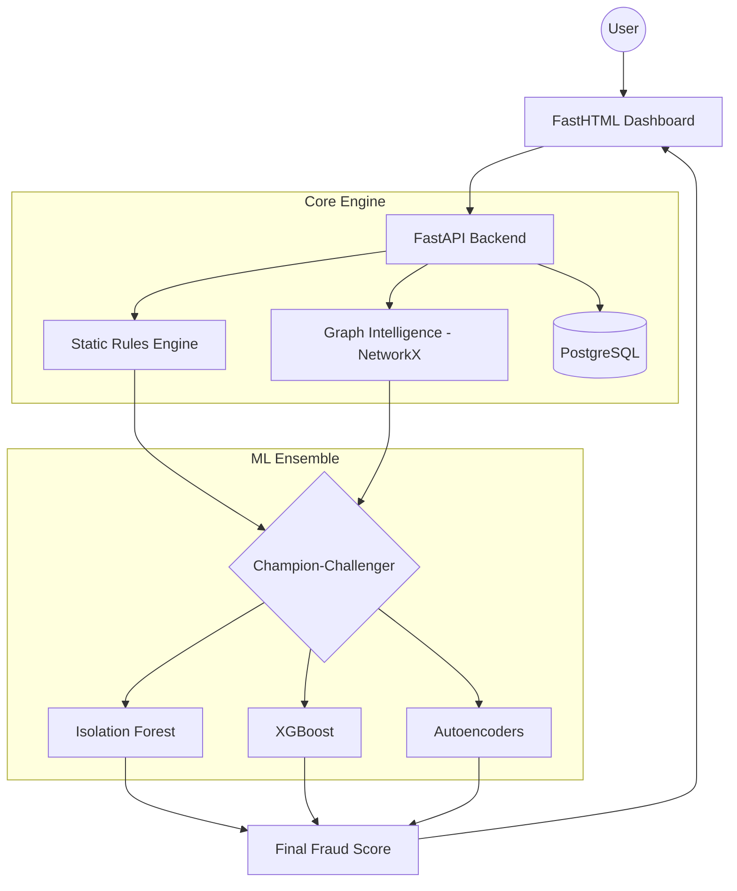

# 🛡️ SentinelGraph AI - Fraud Detection Engine

**SentinelGraph** is a personal porject inspired by real-time fraud detection ecosystem engineered for scalability, modularity, and high-precision anomaly detection. The system integrates **Graph Theory**, **Unsupervised Machine Learning**, and a **Docker-orchestrated microservices architecture** to identify complex fraudulent patterns in financial transaction streams.

## 📖 Table of Contents
1. [System Design & Architecture](#-system-Design-&-architecture)
2. [Key Components](#-key-components)
3. [Orchestration Deployment](#-Orchestration-Deployment)
4. [Detection Pipeline: The Hybrid Approach](#-Detection-Pipeline:-The-Hybrid-Approach)
5. [Tech Stack](#-Tech-stack)
6. [Performance & Metric Strategy](#-Performance-&-Metric-Strategy)
7. [Roadmap & Future Developments](#-Roadmap-&-Future-Developments)

## 🏗️ System Design & Architecture

Designed following **MLOps** best practice, SentinelGraph ensures a strict decoupling between computational logic, model inference, and user interface.

## ⚙️ Key Components
**1. Backend (FastAPI):** A high-performance inference engine managing the data lifecycle, from strict schema validation (Pydantic) to real-time scoring.

**2. ML Wrapper Layer:** An abstraction layer that coordinates multiple models (Isolation Forest, XGBoost) and integrates graph-derived features into the inference pipeline.

**3. Graph Engine (NetworkX):** A topological analysis layer that injects structural features (PageRank, Clustering Coefficient) into the model's input vector.

**4. Persistence Layer (PostgreSQL):** A relational database for persistent storage of transactions, audit logs, and model performance monitoring.

**5. Dashboard (FastHTML):** A high-performance "Hyperpage" frontend powered by HTMX, providing real-time anomaly visualization without the overhead of heavy client-side frameworks.

## 🚀 Orchestration & Deployment 
The entire ecosystem is containerized to ensure full reproducibility across development and production environments.
####  Docker Specifications:
- `backend`: Python 3.11-slim optimized with C-extensions for ML workloads.
- `frontend`: Lightweight FastHTML/Uvicorn environment.
- `.db`: : PostgreSQL 16 instance with persistent volume mapping for data durability.

## 📈 Detection Pipeline: The Hybrid Approach
SentinelGraph does not rely on a single point of failure. It employs a layered defense strategy that combines deterministic logic with probabilistic machine learning.

* **Layer 1: Deterministic Heuristics (The "Coarse" Filter)**

Transactions first hit the **Static Rule Engine**. This layer acts as a high-speed firewall, neutralizing obvious threats—such as high-velocity attacks, blacklisted IDs, or impossible travel scenarios—with zero latency and 100% interpretability.

* **Layer 2: Topological Enrichment (Graph Intelligence)**

For transactions clearing Layer 1, the system reconstructs a Similarity Graph to uncover structural anomalies:

**PageRank Centrality:**  Identifies "hubs" of suspicious activity and influence within the network.

**Clustering Coefficient:** Detects local densities, signaling organized fraud rings or coordinated botnet attacks.

* **Layer 3: The Champion-Challenger Orchestration**

Enriched data is fed into a Champion-Challenger framework. This is not just a comparison, but a real-time race between different mathematical approaches:

* **Supervised (XGBoost):**: The "Pattern Specialist." It learns from labeled historical data to recognize known attack signatures.
* **Unsupervised (Isolation Forest):**: The "Zero-Day Detector." It isolates statistical outliers, catching novel fraud schemes that have no historical precedent.
* **Deep Learning (Autoencoders):**: The "Complexity Expert." It flags transactions with high reconstruction errors, identifying non-linear anomalies in high-dimensional space.

---
## 🛠️ Tech Stack
* **Language**: Python 3.11+
* **API Framework**: `FastAPI` (Asynchronous I/O for low-latency inference)
* **ML & Analytics:**: `Scikit-Learn`, `NumPy`, `Pandas`
* **Network Science**: `NetworkX`
* **UI/UX:**: `FastHTML`, `ailwind CSS`
* **Infrastructure**: `Docker`, `Docker Compose`
* **Frontend**: `Astro` (Separate Repository)

---
## 📊 Performance & Metric Strategy

In fraud detection, **Accuracy is a vanity metric** due to severe class imbalance. SentinelGraph evaluates models based on their ability to handle rare events:

* **Precision-Recall & F1-Score:**: To balance the cost of false positives (bad customer experience) vs. false negatives (financial loss).
* **AUC-ROC & PR-AUC**: To measure the model's discriminative power across all classification thresholds.
* **Cost-Sensitive Learning:**: Optimizing the system to minimize the total financial impact, acknowledging that missing a large transaction is more critical than missing a small one.
---
## 🗺️ Roadmap & Future Developments

* **Real-time Streaming**: Integration with Apache Kafka for live data ingestion.
* **Explainable AI (XAI)**: Integration of SHAP/LIME to provide transparency on why a transaction was flagged.
* **Astro Integration**: Seamlessly embedding FastHTML dashboards into Astro-based corporate portals.

