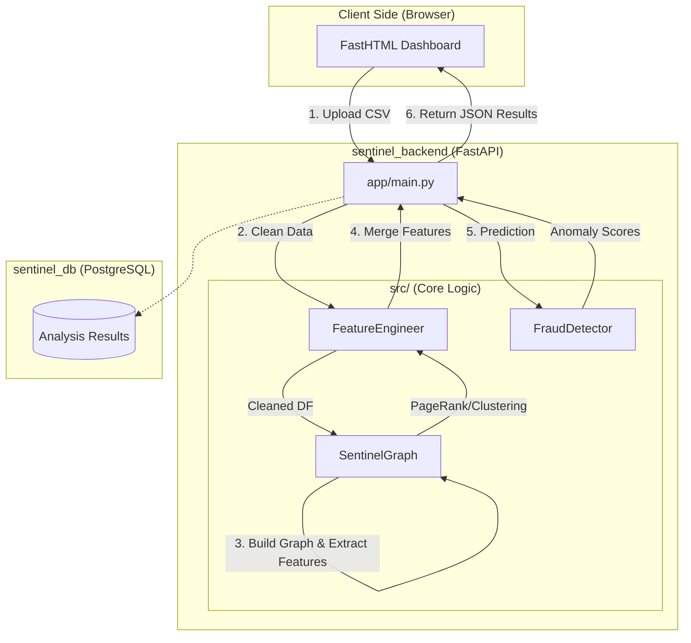

# 🛡️ SentinelGraph AI - Fraud Detection Engine

**SentinelGraph** is an advanced analytical engine that merges **Graph Theory** and **Machine Learning** to identify anomalies within massive financial datasets. Now fully containerized, it utilizes a hybrid pipeline: extracting structural features via **NetworkX** (PageRank, Clustering) and processing them through an **Isolation Forest** model.

---

### 🚀 Quick Start with Docker
The entire stack (Backend, Frontend, and Database) is orchestrated via Docker Compose for a consistent environment.

1. **Clone & Enter**
   ```bash
   git clone [https://github.com/Mar9803/sentinel-backend.git](https://github.com/Mar9803/sentinel-backend.git)
   cd sentinel-backend
```
2. **Launch the Stack**

   ```bash
   docker-compose up --build
```
3. **Access the Services**

* **Frontend Dashboard: `http://localhost:5000` (Powered by FastHTML)
* **API Backend:: `http://localhost:8000`
* **API Documentation: `http://localhost:8000/docs` (Swagger UI)
---

## 🏗️ System Architecture

The project is divided into three main containers:

* `sentinel_backend`: A FastAPI server that orchestrates the ML pipeline (Cleaning -> Graph Analysis -> Prediction).

* `sentinel_frontend`: A responsive dashboard built with FastHTML for real-time data visualization.

* `sentinel_db`: A PostgreSQL instance for persistent storage of analysis results.



---

## 📄 API at a Glance

| Endpoint | Method | Description |
| :--- | :---: | :--- |
| `/analyze` | `POST` | Analyzes a CSV file and returns the top 10 suspicious records. |
| `/api/stats` | `GET` | Returns global engine statistics and metrics. |
| `/` | `GET` | System health check (Status: Online). |

---


## 📚 Full Documentation
For in-depth details regarding the architecture, class logic, and customization, please refer to the [**DOCUMENTATION.md**](./DOCUMENTATION.md).

---

## 🛠️ Tech Stack
* **Backend**: `FastAPI`
* **Analisi**: `NetworkX`, `Scikit-Learn`
* **Data**: `Pandas`, `NumPy`
* **Frontend**: `Astro` (Decoupled)